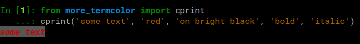

# more_termcolor
##### Pass unlimited number of colors, color-codes, or attributes



##### All [standard](https://en.wikipedia.org/wiki/ANSI_escape_code#3/4_bit), [background](https://en.wikipedia.org/wiki/ANSI_escape_code#SGR_parameters), [bright](https://en.wikipedia.org/wiki/ANSI_escape_code#3/4_bit), or [attribute](https://en.wikipedia.org/wiki/ANSI_escape_code#SGR_parameters) codes are available (or any combination of them)


##### Intelligently handles existing colors in the `text` as to allow adding or combining colors automatically, while ensuring the smallest string size possible


##### Convenience methods that expose shortcuts to common values (`bold('foo')`, `yellow('bar')` etc)


##### 100% compatible with the classic `termcolor` lib: anything that works with `termcolor` works the same with `more_termcolor` 

## Example


```python
# This is also possible:
from more_termcolor.colors import bold, brightgreen
bold_text = bold('text')
fancy = brightgreen(f'this whole string, including this {bold_text} is bright green')
```

<div style='font-family: monospace; margin-left: 10px'>
<span style="color: green">>>></span> 
<span style="color: #8AE234">
this whole string, including this <b>text</b> is bright red
</span>
</div>

## Roadmap (work in progress)
##### - Parse complex `color` args, such as:
```python
cprint('foo', 'bold bright blue on black')
``` 
<div style='font-family: monospace; margin-left: 10px'>
<span style="color: green">>>></span>
 <span style="color: #727FCF; font-weight: 700; background: black">foo</span>
</div>


##### - `pygments`-like support for pseudo HTML tags, e.g.: 
```python
text = "<magenta>some text<on yellow>that shows</on yellow>what's <bold ul>planned</bold ul></magenta>"
cprint(text) 
```
<div style='font-family: monospace; margin-left: 10px'>
<span style="color: green">>>></span> 
<span style="color: magenta">
some text
<span style="background: yellow">that shows</span>
what's
<span style="font-weight: bold"><u>planned</u></span>
</span>
</div>

##### - Custom tags:
```python
text = "<m>some text<oy>that shows</oy>what's <bu>planned</bu></m>"
cprint(text, m='magenta', oy='on yellow', bu='bold ul') 
``` 
<div style='font-family: monospace; margin-left: 10px'>
<span style="color: green">>>></span> 
<span style="color: magenta">
some text
<span style="background: yellow">that shows</span>
what's
<span style="font-weight: bold"><u>planned</u></span>
</span>
</div>

##### - Colorize by regex:
```python
stuff = {'food': 'pizza', 'love': 'wife'}
cprint(stuff, bold=r"'\w+':")

``` 
<div style='font-family: monospace; margin-left: 10px'>
<span style="color: green">>>></span> {<span style="font-weight: 700">'food':</span> 'pizza', <span style="font-weight: 700">'love':</span> 'wife'}
</div>

